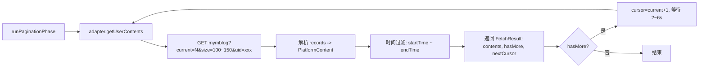
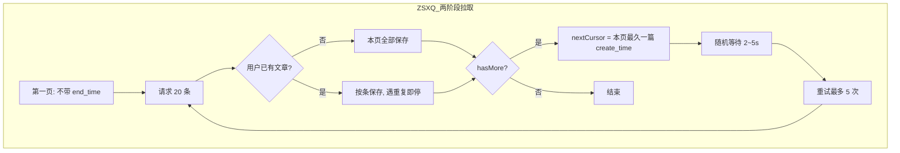
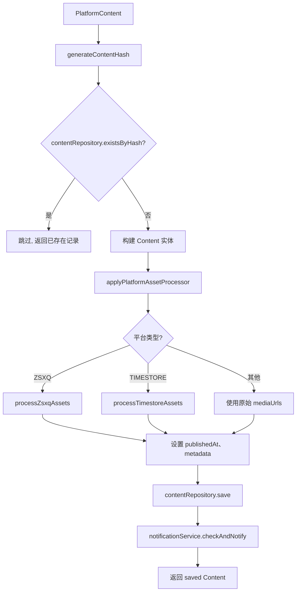
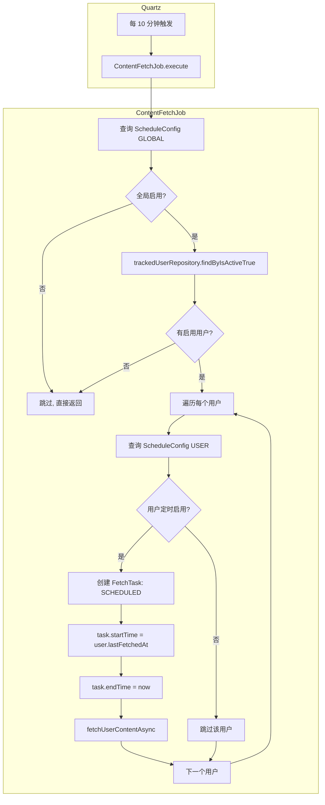
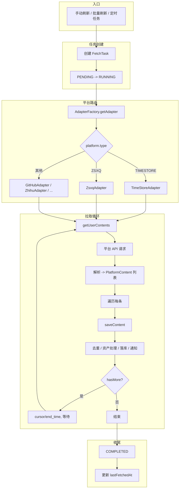

# 内容拉取功能详细梳理

本文档详细描述 CAAT 项目中「批量刷新」「刷新内容」「定时任务刷新」三大功能的完整业务逻辑，以及各平台适配器的差异，并附详细流程图。

---

## 一、功能概览

| 功能 | 入口 | 后端接口 | 任务类型 | 说明 |
|------|------|----------|----------|------|
| **刷新内容** | 用户管理页「刷新内容」 | `POST /api/v1/users/{id}/fetch` | MANUAL | 单用户手动刷新 |
| **批量刷新** | 仪表盘「批量刷新」 | 循环调用单用户 fetch | MANUAL | 前端遍历启用用户，逐个调用单用户刷新 |
| **定时任务刷新** | Quartz 调度器 | 无 HTTP 入口 | SCHEDULED | 每 10 分钟执行，为所有启用用户创建拉取任务 |

> **注意**：`POST /api/v1/users/batch-fetch` 接口当前为 TODO 状态，返回空列表。批量刷新由前端循环调用单用户接口实现。

---

## 二、刷新内容（单用户手动刷新）

### 2.1 业务逻辑总览

用户点击「刷新内容」后，系统为指定用户创建一条 `FetchTask`（类型 MANUAL），并异步执行内容拉取。拉取逻辑根据用户所属平台类型选择对应适配器，调用平台 API 分页获取内容，经去重、资产处理（图片下载等）后保存到数据库。

### 2.2 详细流程图

```mermaid
flowchart TB
    subgraph 前端
        A1[用户点击「刷新内容」] --> A2[POST /users/{id}/fetch]
        A2 --> A3[收到 FetchTask 响应]
        A3 --> A4[轮询任务状态 / 弹窗显示进度]
    end

    subgraph 后端_FetchController
        B1[接收请求] --> B2{校验用户存在?}
        B2 -->|否| B3[抛出 USER_NOT_FOUND]
        B2 -->|是| B4[创建 FetchTask: MANUAL, PENDING（完整拉取）]
        B4 --> B5[保存任务到 DB]
        B5 --> B6[调用 fetchUserContentAsync 异步执行]
        B6 --> B7[立即返回 FetchTask]
    end

    subgraph 后端_ContentFetchService
        C1[fetchUserContentAsync] --> C2[加载 TrackedUser]
        C2 --> C3{用户存在?}
        C3 -->|否| C4[markTaskFailed + 抛异常]
        C3 -->|是| C5[更新任务: RUNNING]
        C5 --> C6[解析平台配置 config]
        C6 --> C7[AdapterFactory.getAdapter 获取适配器]
        C7 --> C8{平台类型?}
        
        C8 -->|ZSXQ + 完整拉取| C9[runZsxqTwoPhaseFetch]
        C8 -->|其他| C10[runPaginationPhase]
        
        C9 --> C11[逐页拉取、保存、更新进度]
        C10 --> C11
        
        C11 --> C12[更新任务: COMPLETED]
        C12 --> C13[更新 user.lastFetchedAt]
        C13 --> C14[异常时: FAILED + errorMessage]
    end

    A2 --> B1
    B7 --> A3
```

### 2.3 拉取模式

手动刷新固定为**完整拉取**：不传时间范围，逐页拉取直到无数据；若用户已有文章，则先估算起始页向前拉取，再拉「最新文章时间～现在」。单页 100~150 条。

### 2.4 平台适配器选择

```
AdapterFactory.getAdapter(platform.type)
  → 已注册适配器: TIMESTORE, ZSXQ, GITHUB, ZHIHU, JUEJIN, CSDN, MEDIUM, REDDIT, WEIBO, TWITTER
  → 根据 platform.type 返回对应 PlatformAdapter 实例
```

---

## 三、各平台拉取逻辑详解

### 3.1 TimeStore 平台

**API**：`GET /timeline/mymblog`（api.timestore.vip）

**分页**：`current`（页码）、`size`（100~150 随机）

**时间过滤**：可选 `date` 参数（startTime 的日期）

**拉取流程**：



**资产处理**：`processTimestoreAssets`  
- 提取 body 与 mediaUrls 中的图片 URL  
- 下载到本地 `uploads/contents/images/`  
- 替换 body 与 mediaUrls 为本地路径  

---

### 3.2 知识星球 (ZSXQ) 平台

**API**：`GET /v2/groups/{groupId}/topics?scope=by_owner&count=20`

**分页**：`end_time`（上一页最后一条的 create_time，ISO 格式）

**特殊逻辑**：完整拉取时使用 `runZsxqTwoPhaseFetch`，与通用分页不同。



**限流与重试**：  
- 每页前随机等待 2~5 秒  
- 请求失败重试最多 5 次  
- 最多翻页 50 页  

**资产处理**：`processZsxqAssets`  
- 图片下载到本地  
- 附件：根据 `file_ids` 调用 ZsxqFileService 获取 download_url，下载到本地，写入 metadata.downloaded_file_urls  

---

### 3.3 其他平台（GitHub、知乎、掘金、CSDN 等）

使用通用 `runPaginationPhase`：

- 调用 `adapter.getUserContents(userId, config, startTime, endTime, cursor, limit)`
- 各适配器实现自己的分页与时间过滤
- 返回 `FetchResult`：contents、hasMore、nextCursor
- 每页保存后等待 2~6 秒，失败重试最多 10 次

---

## 四、内容保存流程（saveContent）



**去重**：`hash = SHA256(contentId | url | publishedAt)`，存在则跳过。

**事务**：`saveContent` 使用 `REQUIRES_NEW`，单条失败不影响其他条。

---

## 五、批量刷新

### 5.1 业务逻辑

批量刷新**无独立后端接口**，由前端实现：

1. 调用 `userApi.getAll({ page: 0, size: 100 })` 获取用户列表
2. 筛选 `isActive === true` 的用户
3. 循环调用 `userApi.fetchContent(user.id)` 为每个用户提交刷新任务

### 5.2 流程图

```mermaid
flowchart TB
    subgraph 前端_Dashboard
        D1[点击「批量刷新」] --> D2[GET /users?page=0&size=100]
        D2 --> D3[筛选 isActive=true]
        D3 --> D4[遍历每个用户]
        D4 --> D5[POST /users/{id}/fetch]
        D5 --> D6{下一个用户?}
        D6 -->|是| D5
        D6 -->|否| D7[提示: 已提交 N 个用户的刷新任务]
    end

    subgraph 后端_每个请求
        E1[创建 FetchTask MANUAL] --> E2[异步 fetchUserContentAsync]
        E2 --> E3[立即返回]
    end

    D5 --> E1
```

**特点**：  
- 多个任务并发执行（@Async）  
- 每个用户独立任务，互不影响  
- 失败时仅 console 打印，不阻断其他用户  

---

## 六、定时任务刷新

### 6.1 调度配置

| 配置项 | 值 | 说明 |
|--------|-----|------|
| Job 类 | ContentFetchJob | Quartz Job |
| Trigger | contentFetchTrigger | SimpleTrigger |
| 执行间隔 | 10 分钟 | 固定间隔 |
| 持久化 | JDBC (QRTZ_* 表) | PostgreSQL |

### 6.2 业务逻辑



### 6.3 时间范围

- **startTime**：`user.getLastFetchedAt()`（上次拉取时间，可为 null）
- **endTime**：`LocalDateTime.now()`
- **fetchMode**：固定 `"normal"`

即：**增量拉取**，从上次拉取时间到当前时间的新内容。

### 6.4 开关控制

| 层级 | 表 | 字段 | 说明 |
|------|-----|------|------|
| 全局 | schedule_configs | type=GLOBAL, is_enabled | 关闭后整个定时任务不执行 |
| 用户 | schedule_configs | type=USER, user_id, is_enabled | 关闭后该用户不参与定时拉取 |

**默认**：无配置时，全局视为启用，用户视为启用。

---

## 七、完整端到端流程图（刷新内容 + 平台拉取）



---

## 八、数据表与实体

| 表/实体 | 用途 |
|---------|------|
| fetch_tasks | 拉取任务记录，含 user_id、task_type(MANUAL/SCHEDULED)、status、progress、fetched_count、error_message 等 |
| schedule_configs | 定时任务配置，GLOBAL 全局开关，USER 按用户开关 |
| tracked_users | 被追踪用户，last_fetched_at 用于增量拉取 |
| contents | 拉取并保存的内容 |
| content_media_urls | 内容关联的媒体 URL（含本地路径） |

---

## 九、总结

| 功能 | 触发方式 | 任务类型 | 时间范围 | 平台差异 |
|------|----------|----------|----------|----------|
| 刷新内容 | 用户点击 | MANUAL | 可选/完整 | ZSXQ 两阶段，TimeStore 分页+日期，其他通用分页 |
| 批量刷新 | 仪表盘点击 | MANUAL | 同单用户 | 前端循环调用单用户接口 |
| 定时任务 | Quartz 10 分钟 | SCHEDULED | lastFetchedAt ~ now | 同单用户，增量拉取 |

所有拉取最终都通过 `ContentFetchService.fetchUserContentAsync` 执行，平台差异封装在各 `PlatformAdapter` 实现中。
